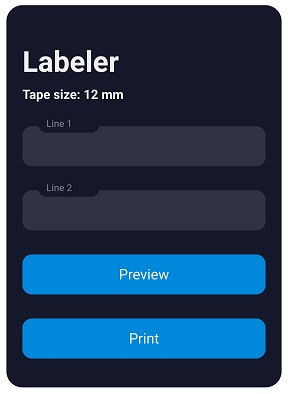

# Labeler
Labeler is a quick and dirty web interface wrapping around [ptouch-print](https://git.familie-radermacher.ch/linux/ptouch-print.git), a Linux driver and interfacing tool for Brother P-Touch printer by [Dominic Radermacher](https://dominic.familie-radermacher.ch/projekte/ptouch-print/). Most of the work is done by ptouch-print, Labeler is just a wrapper to use it within a browser. The design is based on the [Placeholders form by Mikael Ainalem](https://codepen.io/ainalem/pen/GRqPwoz). Currently, the set of features is very limited:

## Features
- Show tape width installed in printer
- Preview of rendered text
- Single and double line prints

A number of additional features are supported by ptouch-print that could be integrated (images, fonts, fontsizes, ...). I will do so, as I required them, but am open to PRs.

## Gallery

Inline-style: 

